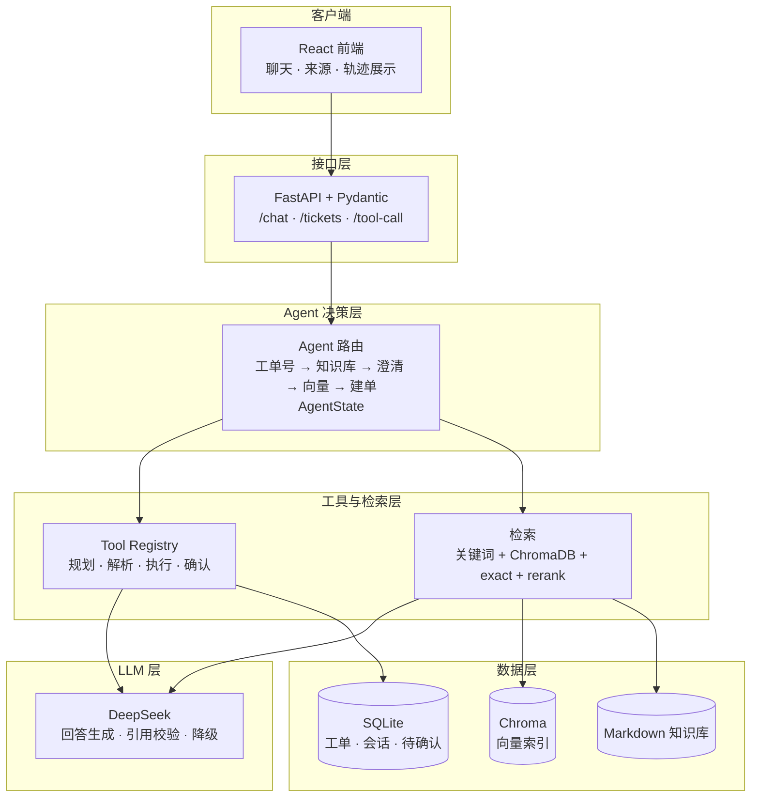
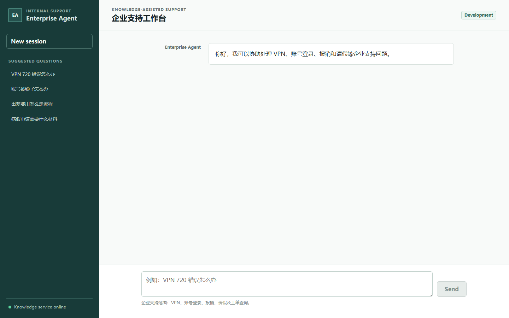
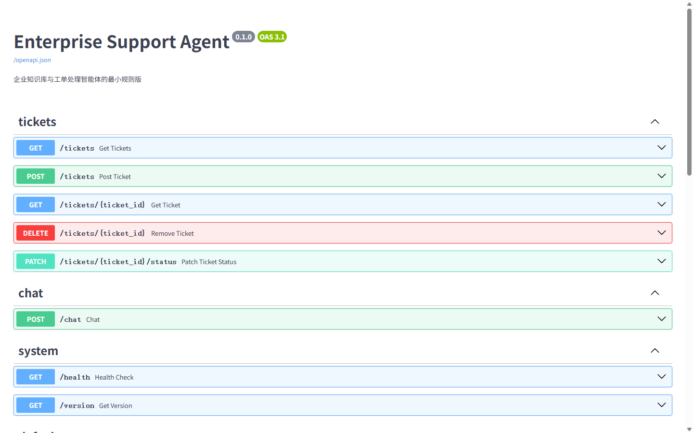

# Enterprise Support Agent

一个面向企业内部 IT 支持场景的 RAG Agent 项目。它把本地 Markdown 知识库、关键词与向量检索、SQLite 工单、真实 DeepSeek 回答生成、工具调用和 React 聊天界面组合为一条可运行、可追踪、可评估的服务链路。

项目用于 27 届秋招 AI Agent 应用开发岗位展示。目标不是做一个只会调用模型的聊天框，而是实现一个能够检索依据、执行工具、保护高风险操作、发生异常时降级，并能被自动化评测验证的企业支持 Agent。

> 📐 系统架构：[跳转查看](#系统架构)

## 已完成能力

- 企业 IT 支持范围识别：非 IT 问题不会误创建工单。
- RAG 问答：本地 Markdown 文档按 chunk 检索，返回文件名、片段、分数与 `chunk_id`。
- 混合检索：关键词检索、ChromaDB 向量检索、exact match 和 rerank 共同提高中文短语、错误码和专有名词的召回。
- 路由决策：工单号查询、高置信回答、低置信澄清、向量检索 fallback、无法解决时创建工单。
- 真实 LLM：已接入 DeepSeek；模型根据当前检索到的知识块生成回答，而不是脱离知识库自由作答。
- 引用可信度校验：LLM 输出的 `File` 与 `Chunk ID` 必须来自本次检索结果；不合法或模型调用失败时自动回退到规则答案。
- 工具调用：支持知识库检索、向量检索、工单查询、创建和删除等工具；可由 DeepSeek 选择工具并生成参数，支持 Prompt 驱动与原生 function calling 两种规划方式。
- 高风险确认：删除工单不会立即执行，会先把待执行操作写入 SQLite，等待同一会话明确确认或取消。
- 会话记忆：支持保存与清除工具调用相关的会话上下文。
- 工单管理：使用 SQLite 持久化，提供创建、查询、状态更新、筛选和删除接口。
- 可观测性：`request_id`、结构化日志与 `workflow_steps` 记录一次请求经过的关键路径。
- React 前端：提供聊天、来源展示、工单信息与执行路径展示界面。
- 评测体系：覆盖 RAG golden case、路由阈值、引用校验、工具确认、数据库、API 契约和端到端流程。
- 一键启动：`start.ps1` 本地脚本与 `docker compose up` 两种方式启动完整服务。
- 双引擎编排：`rules`（if/else 路由）与 `langgraph`（显式状态图路由）两种实现，由 `AGENT_ENGINE` 环境变量切换，行为一致、可随时回退。

## 项目演进

本项目按真实 Agent 应用的基础能力逐步搭建：

1. FastAPI、Pydantic 请求/响应模型和 Markdown 企业知识库。
2. 工单领域模型、关键词检索、规则路由和 JSON 工单原型。
3. ChromaDB 向量检索、混合召回、chunk 级来源引用和 RAG 评测。
4. AgentState、Tool Registry、workflow trace、工具参数解析与执行器。
5. SQLite 工单仓储、数据库迁移、会话记忆和删除确认机制。
6. DeepSeek RAG 回答、LLM 引用校验与规则降级。
7. DeepSeek 工具规划、React + Vite 演示前端和更完整的自动化 eval。
8. Docker 容器化与一键启动：前后端 Dockerfile、docker compose 编排与 `start.ps1` 一键启动脚本。
9. LangGraph 状态图重构：将 if/else 路由升级为显式状态图（9 节点 + 条件边），节点纯函数化，通过 `AGENT_ENGINE` 与规则版并行切换，行为回归一致。

## 系统架构

系统按请求走向分为六层：客户端、接口、Agent 决策、工具与检索、LLM、数据。`request_id` 与 `workflow_steps` 贯穿全链路，保证每次请求可追踪、可复盘。



## 演示场景

运行 `start.ps1` 一键启动后，浏览器打开 http://localhost:5173 即可与 Agent 交互。下方示例由真实运行抓取，可对照 `eval/run_all_eval.py` 的回归评测复现。




### 1. RAG 知识库问答（命中知识库）

用户输入：`VPN 720 错误怎么办`  
响应类型：`answer`  
真实响应要点：返回 720 错误处理步骤（重装虚拟网卡驱动），`sources[0]` 指向 `vpn_guide.md::chunk-6`，`score=6`  
`workflow_steps`：`extract_ticket_id → search_knowledge_base → rule_answer → llm_answer → knowledge_answer`

### 2. 工单状态查询

用户输入：`查一下 TICKET-20260804-0367 的状态`  
响应类型：`ticket_status`  
真实响应要点：直接命中工单号分支，`ticket.status=OPEN`，`assignee=IT Support Team`  
`workflow_steps`：`extract_ticket_id → query_ticket_status → ticket_status`

### 3. 低置信澄清追问（向量检索 fallback）

用户输入：`笔记本电脑无法开机，电源灯不亮，需要报修`  
响应类型：`clarify`（走向量检索后的 `vector_clarify`）  
真实响应要点：关键词检索无高置信命中 → 走 ChromaDB 向量检索 → 命中 `account_login_faq.md::chunk-2`（score=44）等 3 条弱相关 → 提示用户补充信息  
`workflow_steps`：`extract_ticket_id → search_knowledge_base → search_vector_store → vector_clarify`

### 4. 非 IT 问题拦截

用户输入：`工位键盘进水失灵了，需要申请更换键盘`  
响应类型：`clarify`（`unsupported_question`）  
真实响应要点：基于关键词白名单（VPN / 账号 / 报销 / 请假 / 蓝屏 / 打印机等）判断"键盘"不在范围内，返回标准提示  
`workflow_steps`：`extract_ticket_id → unsupported_question`

### 5. 创建工单（知识库无解 → 建单）

用户输入：`打印机驱动安装失败报错0x800f081f，试了官网的方法也没用`  
响应类型：`ticket_created`  
真实响应要点：知识库 + 向量检索均无高置信命中 → 自动创建工单 `TICKET-20260805-0368`，`category=IT_SUPPORT`  
`workflow_steps`：`extract_ticket_id → search_knowledge_base → search_vector_store → create_ticket → ticket_created`

以上五个场景覆盖了 Agent 的所有主要分支（高置信回答 / 工单查询 / 澄清追问 / 非 IT 拦截 / 建单），每一个都有对应的 eval case 与之对应。

### 复现命令

```bash
curl -X POST http://127.0.0.1:8000/chat \
  -H "Content-Type: application/json" \
  -d '{"message": "VPN 720 错误怎么办"}'
```

## 典型工作流

### RAG + DeepSeek 回答

```text
用户：VPN 720 错误怎么办
  ↓
Agent 判断为企业 IT 支持问题
  ↓
search_knowledge_base() 命中 vpn_guide.md::chunk-6
  ↓
规则层先生成可用答案，并把命中的知识块文本、File、Chunk ID 组装进 Prompt
  ↓
DeepSeek 基于本次检索上下文生成自然语言回答与来源引用
  ↓
后端校验 LLM 引用是否都属于本次 sources
  ↓
通过：返回 LLM 答案；失败：保留规则答案并记录 fallback
```

这条链路把职责分开：检索层决定“依据是什么”，LLM 负责“如何组织回答”，引用校验防止模型把不存在或不相关的来源伪装成依据。

### 工单与工具调用

```text
用户消息
  ↓
DeepSeek 或 mock planner 选择工具并输出 JSON
  ↓
解析工具名与 arguments
  ↓
执行普通工具，或检查高风险操作策略
  ↓
delete_ticket 等高风险工具 → 写入 pending confirmation → 等待用户确认
  ↓
Tool Registry 统一执行并返回 workflow_steps
```

## 技术栈

- 后端：Python、FastAPI、Pydantic、Uvicorn
- RAG：Markdown、ChromaDB、关键词检索、向量检索、rerank
- LLM：OpenAI Python SDK、DeepSeek OpenAI 兼容接口
- 数据层：SQLite
- Agent 编排：LangGraph（显式状态图路由，`graph_agent.py`）
- 前端：React、TypeScript、Vite
- 工程化：python-dotenv、结构化日志、eval 脚本、Docker / Docker Compose、PowerShell 启动脚本


## 目录结构

```text
enterprise-support-agent/
├── backend/
│   ├── app/
│   │   ├── agent.py                 # /chat 主路由与 RAG 决策
│   │   ├── graph_agent.py           # LangGraph 状态图版路由（AGENT_ENGINE=langgraph 时启用）
│   │   ├── agent_state.py            # 单次请求状态
│   │   ├── knowledge_base.py         # Markdown 关键词检索
│   │   ├── vector_store.py           # ChromaDB 向量检索
│   │   ├── prompt_builder.py         # RAG 回答 Prompt
│   │   ├── llm_client.py             # Stub / OpenAI / DeepSeek 回答调用
│   │   ├── database.py               # SQLite 初始化与连接
│   │   ├── ticket_repository.py      # 工单持久化仓储
│   │   ├── tool_registry.py          # 工具注册与统一调用
│   │   ├── tool_call_*.py            # 工具规划、解析、执行与接口
│   │   ├── tool_confirmation.py      # 高风险操作确认
│   │   └── routers/                  # chat 与 tickets 路由
│   ├── data/
│   │   ├── docs/                     # 企业知识库 Markdown
│   │   ├── chroma/                   # 本地向量索引
│   │   └── enterprise_support_agent.db
│   ├── Dockerfile                    # 后端容器镜像
│   ├── .dockerignore
│   └── requirements.txt
├── frontend/                         # React + Vite 聊天前端
│   ├── Dockerfile                    # 前端两阶段构建（nginx 托管）
│   └── .dockerignore
├── eval/                             # 回归评测与 RAG golden case
├── docs/
│   └── resume_interview_pack.md      # 简历与面试素材
├── start.ps1                         # 一键启动脚本（后端 + 前端）
├── docker-compose.yml                # Docker 一键编排
├── .env.example
└── README.md
```

## API 概览

| 接口 | 作用 |
| --- | --- |
| `GET /health` | 服务健康检查 |
| `GET /version` | 服务版本信息 |
| `POST /chat` | 企业支持 RAG 问答、工单查询与创建 |
| `GET /tickets` | 获取工单列表，支持状态筛选 |
| `POST /tickets` | 创建工单 |
| `GET /tickets/{ticket_id}` | 查询指定工单 |
| `PATCH /tickets/{ticket_id}/status` | 更新工单状态 |
| `DELETE /tickets/{ticket_id}` | 删除工单 |
| `POST /tool-call/demo` | 工具调用演示入口 |
| `POST /tool-call/auto` | 自动工具规划与执行入口 |
| `POST /conversation-memory/clear` | 清除指定会话的工具调用记忆 |

`POST /chat` 示例：

```json
{
  "message": "VPN 720 错误怎么办"
}
```

核心响应字段：

```text
request_id       单次请求追踪 ID
type             answer / clarify / ticket_created / ticket_status
answer           最终回答
sources          当前检索命中的知识来源
ticket           查询或创建得到的工单
workflow_steps   本次 Agent 的执行路径
```

## 本地运行

在项目根目录执行：

```powershell
cd C:\Users\21922\Documents\Codex\2026-07-24\1\enterprise-support-agent
```

### 0. 一键启动（推荐）

两种方式任选其一，效果等价。

方式一：PowerShell 脚本（不依赖 Docker，适合本机演示）

```powershell
.\start.ps1
```

脚本会自动检查虚拟环境、构建向量索引，并后台启动后端（8000）与前端（5173）；按回车统一停止所有服务。如遇 PowerShell 执行策略限制，改用：

```powershell
powershell -ExecutionPolicy Bypass -File .\start.ps1
```

方式二：Docker Compose（需要 Docker 环境）

```powershell
docker compose up --build
```

一条命令构建并启动三个服务：`backend-init`（构建向量索引后退出）、`backend`（8000）、`frontend`（5173）。SQLite 与 Chroma 数据通过数据卷持久化，`.env` 由 compose 注入容器，无需在容器内放置密钥文件。

### 1. 安装后端依赖

```powershell
.\backend\.venv\Scripts\python.exe -m pip install -r backend\requirements.txt
```

### 2. 配置环境变量

复制 `.env.example` 为 `.env`，开发时可保持 Stub；使用真实 DeepSeek 时填写自己的 Key：

```text
ENABLE_LLM_ANSWER=true
LLM_PROVIDER=deepseek
DEEPSEEK_API_KEY=你的真实密钥
DEEPSEEK_BASE_URL=https://api.deepseek.com
DEEPSEEK_MODEL=deepseek-v4-flash
DEEPSEEK_TIMEOUT_SECONDS=20

TOOL_CALL_PROVIDER=deepseek
```

`.env` 已被 `.gitignore` 忽略，真实 Key 不应提交到仓库。

支持的回答模型 provider：

- `stub`：本地稳定占位实现，适合开发与离线 eval。
- `openai`：通过 OpenAI API 生成回答。
- `deepseek`：通过 OpenAI 兼容 SDK 调用 DeepSeek。

### 3. 构建向量索引

```powershell
cd backend
.\.venv\Scripts\python.exe -m scripts.build_vector_index
cd ..
```

### 4. 启动后端

```powershell
.\backend\.venv\Scripts\python.exe -m uvicorn app.main:app --reload --port 8000
```

接口文档：<http://127.0.0.1:8000/docs>

### 5. 启动前端

另开一个终端：

```powershell
cd C:\Users\21922\Documents\Codex\2026-07-24\1\enterprise-support-agent\frontend
npm install
npm run dev
```

前端地址：<http://localhost:5173>

后端已配置 `localhost:5173` 与 `127.0.0.1:5173` 的 CORS，前端可以直接调用 `/chat`。

## 评测与验证

统一入口：

```powershell
.\backend\.venv\Scripts\python.exe eval\run_all_eval.py
```

它目前会顺序运行 28 组本地、可复现的评测，重点包括：

- 配置解析与 Prompt 构造。
- Tool Registry、工具参数解析、执行器、schema 一致性与确认机制。
- Agent 路由、非 IT 问题拦截、关键词/向量检索阈值与 RAG golden case。
- LLM Stub、无 Key fallback、错误引用 fallback。
- SQLite 数据库、工单仓储与历史 JSON 迁移。
- FastAPI 启动、API smoke、接口契约、会话记忆与端到端用户流程。

真实模型 smoke test 单独运行，避免每次回归都产生 API 成本：

```powershell
$env:RUN_REAL_LLM_EVAL="true"
.\backend\.venv\Scripts\python.exe eval\run_real_llm_smoke_eval.py
```

真实模型评测会验证 DeepSeek 回答链路与来源引用，不应把它加入日常全量回归。

## 关键工程设计

### 1. AgentState 与 workflow_steps

一次 `/chat` 请求会持有一个 `AgentState`，其中记录用户消息、检索结果、来源、工单、最终回答和执行步骤。业务分支只更新状态，最后统一构造 `ChatResponse`，避免在一个函数里堆积难以追踪的局部变量。

例如一次 DeepSeek RAG 回答的步骤可能是：

```text
extract_ticket_id
search_knowledge_base
rule_answer
llm_answer
knowledge_answer
```

### 2. 规则答案优先准备，LLM 可替换

高置信知识命中后，系统总会先生成规则答案。开启 LLM 时，才额外请求 DeepSeek；如果模型超时、无 Key、返回空内容或引用不可信，系统仍有确定性的规则答案可以返回。因此外部模型失败不会让核心 IT 支持流程失效。

### 3. 引用校验

后端从 LLM 答案中提取 `File` 与 `Chunk ID`，并与当前检索结果比对。模型引用不存在的 chunk，或把别的文件和当前 chunk 拼接在一起，都不会被接受。该机制降低了 RAG 回答中“看起来有引用、实际没依据”的风险。

### 4. 工具调用安全边界

工具规划器负责选工具，解析器负责把模型输出变成结构化参数，执行器负责真正执行。`delete_ticket` 被标为高风险工具：先保存待确认操作，再等待同一 `session_id` 的确认消息，避免模型或用户的单次表达直接删除数据。

### 5. 双引擎编排（rules / langgraph）

Agent 路由提供两种实现，由 `AGENT_ENGINE` 环境变量切换，默认 `rules`：

- `rules`：`agent.py` 的 if/else 顺序路由，稳定、直接，被 28 组本地 eval 覆盖。
- `langgraph`：`graph_agent.py` 的显式状态图，9 个节点（提取工单号、查单、范围判断、关键词检索、高置信回答、澄清、向量检索、向量澄清、建单）+ 4 条条件边。节点是纯函数，只返回对 state 的增量更新；`workflow_steps` 通过 LangGraph 的 reducer（`Annotated[list, operator.add]`）自动追加，与规则版行为一致。

两种实现复用同一批辅助函数（`_is_support_related`、`_has_valid_llm_citations`、检索与 LLM 调用），输出可逐条对比；切换通过 `_resolve_handler()` 延迟 import 完成，默认路径零额外开销。状态图把"路由决策"从代码中显式化，后续新增节点（如工单升级、转人工）只需加节点与边，不动主干。

### 6. 工具规划双实现（Prompt 驱动 / 原生 function calling）

工具选择由 `TOOL_CALL_PROVIDER` 切换：

- `deepseek`：Prompt 驱动 JSON 计划——把工具 schema 拼进提示词，模型输出自由文本 JSON，再解析出 `tool_name` 与 `arguments`。
- `deepseek_native`：原生 function calling——通过 OpenAI 兼容 `tools` 参数传递工具 schema（内部平铺格式经 `_to_native_tools()` 适配为标准 `{"type": "function", "function": {...}}`），模型直接返回结构化 `tool_calls`，解析成本更低、输出更稳定。

两者返回格式一致（`{"tool_name", "arguments"}`），Parser 与 Executor 无感知。原生版依赖模型对 `tools` 参数的原生支持，且调用方必须保证 `.env` 已加载（`load_dotenv` 仅在 `app.main` 执行，独立脚本需自行加载），否则会走"无 Key → 空计划"的安全降级。

## 面试介绍

可以用下面这段介绍项目：

> 我做了一个企业 IT 支持 Agent。它先判断用户是否在问企业支持问题，再根据工单号、知识库置信度和检索结果决定查询工单、回答、追问或创建工单。RAG 层结合关键词检索、ChromaDB 向量检索、exact match 和 rerank，并以 chunk 级来源返回证据。高置信命中后，我把当前知识块作为上下文传给 DeepSeek 生成自然语言回答，同时校验模型返回的文件与 chunk 引用；不合法或模型异常就降级到规则答案。除此之外，我实现了工具规划、统一执行、SQLite 持久化和删除确认，并通过 28 组本地 eval 覆盖核心分支。前端使用 React 展示回答、来源、工单和 Agent 执行轨迹。项目同时提供 PowerShell 一键启动脚本与 Docker Compose 编排，分别满足本机演示与容器化交付。

