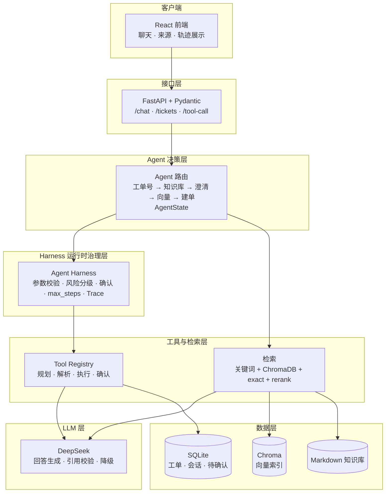

# Enterprise Support Agent

[](https://github.com/FEI77321/enterprise-support-agent/actions/workflows/agent-quality-gate.yml)

一个面向企业内部 IT 支持场景的 RAG Agent 项目。它把本地 Markdown 知识库、关键词与向量检索、SQLite 工单、真实 DeepSeek 回答生成、工具调用、Agent Harness 运行时治理和 React 聊天界面组合为一条可运行、可追踪、可评估的服务链路。

项目用于 27 届秋招 AI Agent 应用开发岗位展示。目标不是做一个只会调用模型的聊天框，而是实现一个能够检索依据、执行工具、保护高风险操作、发生异常时降级，并能被自动化评测验证的企业支持 Agent。

> 📐 系统架构：[跳转查看](#系统架构)

## 已完成能力

- 企业 IT 支持范围识别：非 IT 问题不会误创建工单。
- RAG 问答：本地 Markdown 文档按 chunk 检索，返回文件名、片段、分数与 `chunk_id`。
- 混合检索：关键词检索、ChromaDB 向量检索、exact match 和 rerank 共同提高中文短语、错误码和专有名词的召回。
- 路由决策：工单号查询、高置信回答、低置信澄清、向量检索 fallback、无法解决时创建工单。
- 真实 LLM：已接入 DeepSeek；模型根据当前检索到的知识块生成回答，而不是脱离知识库自由作答。
- 引用可信度校验：LLM 输出的 `File` 与 `Chunk ID` 必须来自本次检索结果；不合法或模型调用失败时自动回退到规则答案。
- 工具调用：支持知识库检索、向量检索、工单查询、创建和删除等工具；可由 DeepSeek 选择工具并生成参数，支持 Prompt 驱动与原生 function calling 两种规划方式。
- 权限与审批：员工仅能读取归属工单，Support 可处理工单，管理员才可删除/审批高风险操作；审批具备操作 ID、会话绑定、5 分钟 TTL 与单次消费审计。
- 写操作可靠性：创建等写工具使用幂等 Operation Record；同 key 成功结果复用，冲突 key 拦截，结果未知时禁止盲重试。
- Agent Harness：rules Agent、LangGraph 与 Tool Calling 的真实工具执行统一经过 Harness，执行前进行注册与参数校验、风险分级、删除确认和请求级 `max_steps` 控制，并在响应中返回受限参数摘要的执行 Trace。
- Context Engineering：短期会话不再只做固定窗口截断；超预算历史会被压缩为可审计的滚动结构化摘要，保留最近对话、稳定业务实体与已完成步骤，并与长期偏好、RAG Evidence 按统一 Token Budget 组装。
- 工单管理：使用 SQLite 持久化，提供创建、查询、状态更新、筛选和删除接口。
- 可观测性：`request_id`、结构化日志、SQLite root/span Trace 与 AgentOps 指标记录安全、改写、检索、工具、审批、记忆、Context Budget 和输出链路。
- Bad Case 回流：失败案例必须绑定真实 `request_id`，按 `open → triaged → regression_added → resolved` 治理；只有已纳入回归的案例才能从原始 Trace 导出为版本化 Eval Dataset。
- CI 回归门禁：GitHub Actions 在 PR、推送 main 与手动触发时运行离线 Agent 质量门禁，并独立执行前端 lint、TypeScript 检查和生产构建。
- React 前端：提供聊天、来源展示、工单信息、可扫读的执行 Timeline，以及由 Trace 直接创建/推进/导出 Bad Case 的质量治理面板。
- 评测体系：覆盖 RAG golden case、路由阈值、引用校验、工具确认、数据库、API 契约和端到端流程。
- 一键启动：`start.ps1` 本地脚本与 `docker compose up` 两种方式启动完整服务。
- 双引擎编排：`rules`（if/else 路由）与 `langgraph`（显式状态图路由）两种实现，由 `AGENT_ENGINE` 环境变量切换，行为一致、可随时回退。

## 项目演进

本项目按真实 Agent 应用的基础能力逐步搭建：

1. FastAPI、Pydantic 请求/响应模型和 Markdown 企业知识库。
2. 工单领域模型、关键词检索、规则路由和 JSON 工单原型。
3. ChromaDB 向量检索、混合召回、chunk 级来源引用和 RAG 评测。
4. AgentState、Tool Registry、workflow trace、工具参数解析与执行器。
5. SQLite 工单仓储、数据库迁移、会话记忆和删除确认机制。
6. DeepSeek RAG 回答、LLM 引用校验与规则降级。
7. DeepSeek 工具规划、React + Vite 演示前端和更完整的自动化 eval。
8. Docker 容器化与一键启动：前后端 Dockerfile、docker compose 编排与 `start.ps1` 一键启动脚本。
9. LangGraph 状态图重构：将 if/else 路由升级为显式状态图（9 节点 + 条件边），节点纯函数化，通过 `AGENT_ENGINE` 与规则版并行切换，行为回归一致。
10. Agent Harness 运行时治理：将 rules、LangGraph 与 Tool Calling 的真实工具执行收敛到统一入口，补齐风险等级、确认策略、参数拦截、请求级步数上限和 Trace；保留 feature flag 以便回退至原工具调用路径。
11. Agent 生产化闭环：补齐 RBAC/资源归属、审批身份、写操作幂等与结果未知治理、AgentOps 指标、Trace Timeline 与长期 Memory Write Gate。
12. 持续质量闭环：将 Bad Case 与 Trace 强关联，完成失败分类、生命周期审计、回流 Dataset 导出和 AgentOps 未解决计数；同时以 GitHub Actions 固化后端回归与前端构建门禁。
13. Context Engineering：会话原文始终保留在 SQLite 审计表，超预算时仅把较早历史滚动压缩为不可信结构化摘要；最近窗口、长期显式偏好与 RAG Evidence 分层限额，预算和裁剪结果写入 Trace / AgentOps。

## RAG 2.0：受控文档摄入实验（当前增量）

除原有的 Markdown + ChromaDB 主检索链路外，项目新增了一条**隔离、默认关闭**的文档摄入实验链路。它的目的不是替换现有检索，而是验证企业文档在版本、失败隔离、来源回链和灰度接入方面的最小治理闭环。

```text
受管文件路径
  → SHA-256 内容哈希与逻辑文档幂等判断
  → Markdown / 文本型 PDF 解析
  → 标题感知 Parent / Child Chunk
  → SQLite 文档、版本、Chunk 元数据
  → active + INDEXED 准入的隔离词面检索
  → 文件 / 版本 / 标题路径 / 页码来源回链
  → 仅在显式开关开启且旧关键词检索无结果时，作为 rules Agent fallback
```

这条链路由 `INGESTED_KNOWLEDGE_EXPERIMENT_ENABLED=false` 默认关闭；关闭时不会访问实验检索库，也不会改变既有 31 条主 RAG 黄金集路径。打开后，它仅在旧关键词检索未命中时尝试 SQLite 实验检索；无结果或异常时，仍继续原有的向量检索 / 澄清 / 建单流程。因此它是可回退的实验入口，不是生产默认能力，也尚未移植到 LangGraph 分支。

| 已验证项 | 证据 | 结论 |
| --- | --- | --- |
| 摄入与版本 | 摄入契约 5/5 | Markdown、文本型 PDF、同 hash 重入复用、扫描件失败隔离、v2 替代 v1 均有可复现验证。 |
| 来源回链 | 来源契约 3/3 | 新链路结果可返回文件、版本、页码；Markdown 额外返回标题路径，基础 PDF 不伪造视觉标题。 |
| 隔离检索 | 检索契约 3/3 | 仅 active 文档且 `INDEXED` 的 Child Chunk 可检索；PENDING、旧版本和失败扫描件不会命中。 |
| 受控接入 | feature flag 契约 2/2 | 默认关闭不调用实验检索；打开时命中结果可带完整来源，失败继续旧 fallback。 |
| 复杂 PDF 边界 | PDF 基线 2/2 | `pypdf` 可保留文本事实和页码，但不保留表格行列结构；MinerU 暂不接入。 |

RAG 2.0 的架构、指标、边界与取舍见：[架构说明](RAG%202.0%20架构说明.md)、[实验与来源设计](docs/rag2_ingestion_source_reference_design.md)、[PDF 时间盒报告](docs/rag2_pdf_parser_timebox_report.md)、[Chroma ADR](选型说明.md)、[面试题卡](RAG%202.0%20面试深挖题卡.md) 和 [3—5 分钟演示稿](面试一句话.md)。

## 系统架构

系统按请求走向分为七层：客户端、接口、Agent 决策、Harness 运行时治理、工具与检索、LLM、数据。`request_id`、`workflow_steps` 与 Harness Trace 共同记录一次请求的业务路由和真实工具执行情况。



## Agent Harness 运行时治理（当前增量）

`AgentHarness` 是所有真实工具执行前的统一治理层，不参与“下一步业务该走哪条边”的决策，也不重写 Tool Registry 中的业务 handler：

```text
rules Agent / LangGraph / Tool Calling
                ↓
       AgentHarness.execute_tool()
  工具注册与参数校验 / 风险等级 / 确认策略
       请求级 max_steps / 执行 Trace / 错误分类
                ↓
         Tool Registry → 真实工具
```

三条实际接入路径如下：

- **rules Agent**：`agent.py` 中查询工单、关键词检索、向量检索与创建工单统一通过 `_run_rules_tool()`。
- **LangGraph**：`graph_agent.py` 的业务节点和条件边保持原样，但对应工具调用通过 `_run_graph_tool()` 进入 Harness。
- **Tool Calling**：`tool_call_executor.py` 通过 Harness 执行已解析计划；高风险删除在用户确认后仍以 `confirmed=True` 再次经过 Harness，避免确认后的真实执行绕过 Trace、参数校验或步数控制。

### 风险策略与 Trace

| 工具类别 | 风险等级 | Harness 策略 |
| --- | --- | --- |
| 工单查询、关键词/向量检索 | `read_only` | 校验后直接执行 |
| 创建工单 | `write_low_risk` | 校验后执行并记录 Trace |
| 删除工单 | `write_high_risk` | 首次返回 `confirmation_required`；确认后才执行 |

Harness 在调用真实 handler 前依次检查：请求是否已经达到 `max_steps`、工具是否已注册、参数能否绑定、该操作是否需要确认。未知工具、参数非法、未确认删除和步数超限都不会进入真实 handler。每个 `HarnessTraceStep` 记录步骤号、工具名、风险等级、受限长度的参数摘要、状态、耗时和错误类型；`ChatResponse.harness_trace` 会在 rules / LangGraph 路径中返回本次请求的 Trace。

默认配置如下，可通过环境变量回退或调整上限：

```env
AGENT_HARNESS_ENABLED=true
AGENT_HARNESS_MAX_STEPS=4
```

设置 `AGENT_HARNESS_ENABLED=false` 时，项目回退到改造前的工具调用路径，且不创建 Harness Session 或 Trace。

当前边界：Harness 不是 LangGraph 的替代品，前者治理真实工具执行，后者负责业务节点和条件边。Trace 已升级为 SQLite 持久化回放能力（`/traces/{request_id}`）；RBAC、读工具受控重试/超时、写操作幂等与结果未知治理均已接入。跨请求任务恢复、多 Agent 和隔离 Sandbox 仍是后续扩展方向；LLM 重试、RAG fallback 和 Redis 限流仍由既有模块负责。

架构说明与面试追问见：[Harness 架构说明](docs/agent_harness_architecture.md) 和 [Harness 面试题卡](docs/agent_harness_interview_cards.md)。

## 演示场景

运行 `start.ps1` 一键启动后，浏览器打开 http://localhost:5173 即可与 Agent 交互。下方示例由真实运行抓取，可对照 `eval/run_all_eval.py` 的回归评测复现。


### 1. RAG 知识库问答（命中知识库）

用户输入：`VPN 720 错误怎么办`  
响应类型：`answer`  
真实响应要点：返回 720 错误处理步骤（重装虚拟网卡驱动），`sources[0]` 指向 `vpn_guide.md::chunk-6`，`score=6`  
`workflow_steps`：`extract_ticket_id → search_knowledge_base → rule_answer → llm_answer → knowledge_answer`

### 2. 工单状态查询

用户输入：`查一下 TICKET-20260804-0367 的状态`  
响应类型：`ticket_status`  
真实响应要点：直接命中工单号分支，`ticket.status=OPEN`，`assignee=IT Support Team`  
`workflow_steps`：`extract_ticket_id → query_ticket_status → ticket_status`

### 3. 低置信澄清追问（向量检索 fallback）

用户输入：`笔记本电脑无法开机，电源灯不亮，需要报修`  
响应类型：`clarify`（走向量检索后的 `vector_clarify`）  
真实响应要点：关键词检索无高置信命中 → 走 ChromaDB 向量检索 → 命中 `account_login_faq.md::chunk-2`（score=44）等 3 条弱相关 → 提示用户补充信息  
`workflow_steps`：`extract_ticket_id → search_knowledge_base → search_vector_store → vector_clarify`

### 4. 非 IT 问题拦截

用户输入：`工位键盘进水失灵了，需要申请更换键盘`  
响应类型：`clarify`（`unsupported_question`）  
真实响应要点：基于关键词白名单（VPN / 账号 / 报销 / 请假 / 蓝屏 / 打印机等）判断"键盘"不在范围内，返回标准提示  
`workflow_steps`：`extract_ticket_id → unsupported_question`

### 5. 创建工单（知识库无解 → 建单）

用户输入：`打印机驱动安装失败报错0x800f081f，试了官网的方法也没用`  
响应类型：`ticket_created`  
真实响应要点：知识库 + 向量检索均无高置信命中 → 自动创建工单 `TICKET-20260805-0368`，`category=IT_SUPPORT`  
`workflow_steps`：`extract_ticket_id → search_knowledge_base → search_vector_store → create_ticket → ticket_created`

以上五个场景覆盖了 Agent 的所有主要分支（高置信回答 / 工单查询 / 澄清追问 / 非 IT 拦截 / 建单），每一个都有对应的 eval case 与之对应。

### 复现命令

```bash
curl -X POST http://127.0.0.1:8000/chat \
  -H "Content-Type: application/json" \
  -d '{"message": "VPN 720 错误怎么办"}'
```

## 典型工作流

### RAG + DeepSeek 回答

```text
用户：VPN 720 错误怎么办
  ↓
Agent 判断为企业 IT 支持问题
  ↓
search_knowledge_base() 命中 vpn_guide.md::chunk-6
  ↓
规则层先生成可用答案，并把命中的知识块文本、File、Chunk ID 组装进 Prompt
  ↓
DeepSeek 基于本次检索上下文生成自然语言回答与来源引用
  ↓
后端校验 LLM 引用是否都属于本次 sources
  ↓
通过：返回 LLM 答案；失败：保留规则答案并记录 fallback
```

这条链路把职责分开：检索层决定“依据是什么”，LLM 负责“如何组织回答”，引用校验防止模型把不存在或不相关的来源伪装成依据。

### 工单与工具调用

```text
用户消息
  ↓
DeepSeek 或 mock planner 选择工具并输出 JSON
  ↓
解析工具名与 arguments
  ↓
执行普通工具，或检查高风险操作策略
  ↓
delete_ticket 等高风险工具 → 写入 pending confirmation → 等待用户确认
  ↓
Tool Registry 统一执行并返回 workflow_steps
```

## 技术栈

- 后端：Python、FastAPI、Pydantic、Uvicorn
- RAG：Markdown、ChromaDB、关键词检索、向量检索、rerank
- LLM：OpenAI Python SDK、DeepSeek OpenAI 兼容接口
- 数据层：SQLite
- Agent 编排：LangGraph（显式状态图路由，`graph_agent.py`）、rules Agent、Agent Harness
- Agent 工具协议：MCP Python SDK 2.x（stdio Server + Inspector）
- 前端：React、TypeScript、Vite
- 工程化：SQLite Trace / Bad Case 生命周期、AgentOps、Eval Dataset、GitHub Actions、python-dotenv、结构化日志、Docker / Docker Compose、PowerShell 启动脚本


## 目录结构

```text
enterprise-support-agent/
├── backend/
│   ├── app/
│   │   ├── agent.py                 # /chat 主路由与 RAG 决策
│   │   ├── graph_agent.py           # LangGraph 状态图版路由（AGENT_ENGINE=langgraph 时启用）
│   │   ├── agent_state.py            # 单次请求状态
│   │   ├── knowledge_base.py         # Markdown 关键词检索
│   │   ├── vector_store.py           # ChromaDB 向量检索
│   │   ├── prompt_builder.py         # RAG 回答 Prompt
│   │   ├── llm_client.py             # Stub / OpenAI / DeepSeek 回答调用
│   │   ├── database.py               # SQLite 初始化与连接
│   │   ├── ticket_repository.py      # 工单持久化仓储
│   │   ├── tool_registry.py          # 工具注册与统一调用
│   │   ├── agent_harness.py          # 统一工具执行治理、步数限制与请求级 Trace
│   │   ├── bad_case_store.py          # Bad Case 生命周期、审计与回流 Dataset 组装
│   │   ├── tool_call_*.py            # 工具规划、解析、执行与接口
│   │   ├── tool_confirmation.py      # 高风险操作确认
│   │   └── routers/                  # chat、tickets、traces 与 bad-cases 路由
│   ├── data/
│   │   ├── docs/                     # 企业知识库 Markdown
│   │   ├── chroma/                   # 本地向量索引
│   │   └── enterprise_support_agent.db
│   ├── Dockerfile                    # 后端容器镜像
│   ├── .dockerignore
│   └── requirements.txt
├── frontend/                         # React + Vite 聊天前端
│   ├── Dockerfile                    # 前端两阶段构建（nginx 托管）
│   └── .dockerignore
├── eval/                             # 回归评测与 RAG golden case
├── .github/workflows/                # GitHub Actions 质量门禁
├── mcp_server/
│   └── server.py                     # 只读 MCP 工具适配层
├── docs/
│   ├── resume_interview_pack.md      # 简历与面试素材
│   ├── agent_harness_architecture.md # Harness 架构与边界
│   └── agent_harness_interview_cards.md # Harness 面试题卡
├── start.ps1                         # 一键启动脚本（后端 + 前端）
├── docker-compose.yml                # Docker 一键编排
├── .env.example
└── README.md
```

## API 概览

| 接口 | 作用 |
| --- | --- |
| `GET /health` | 服务健康检查 |
| `GET /version` | 服务版本信息 |
| `POST /chat` | 企业支持 RAG 问答、工单查询与创建 |
| `GET /tickets` | 获取工单列表，支持状态筛选 |
| `POST /tickets` | 创建工单 |
| `GET /tickets/{ticket_id}` | 查询指定工单 |
| `PATCH /tickets/{ticket_id}/status` | 更新工单状态 |
| `DELETE /tickets/{ticket_id}` | 删除工单 |
| `POST /tool-call/demo` | 工具调用演示入口 |
| `POST /tool-call/auto` | 自动工具规划与执行入口 |
| `POST /conversation-memory/clear` | 清除指定会话的工具调用记忆 |
| `GET /traces/{request_id}` | 回放一次完整 Agent Trace |
| `GET /traces/{request_id}/timeline` | 获取按执行顺序整理的 Trace Timeline |
| `GET /traces/agentops` | 获取聚合运行指标及未解决 Bad Case 数 |
| `POST /bad-cases` | 将指定 Trace 标记为 Bad Case |
| `PATCH /bad-cases/{bad_case_id}` | Support / Admin 推进 Bad Case 生命周期 |
| `POST /bad-cases/{bad_case_id}/export` | Support / Admin 导出已纳入回归的 Eval Case |

`POST /chat` 示例：

```json
{
  "message": "VPN 720 错误怎么办"
}
```

核心响应字段：

```text
request_id       单次请求追踪 ID
type             answer / clarify / ticket_created / ticket_status
answer           最终回答
sources          当前检索命中的知识来源
ticket           查询或创建得到的工单
workflow_steps   本次 Agent 的执行路径
harness_trace    Harness 开启时的请求级真实工具执行轨迹；关闭时为空
```

## 本地运行

在项目根目录执行后续命令；不要使用复制前项目遗留的绝对路径或虚拟环境。

```powershell
Get-Location
```

### 0. 一键启动（推荐）

两种方式任选其一，效果等价。

方式一：PowerShell 脚本（不依赖 Docker，适合本机演示）

```powershell
.\start.ps1
```

脚本会自动检查虚拟环境、构建向量索引，并后台启动后端（8000）与前端（5173）；按回车统一停止所有服务。如遇 PowerShell 执行策略限制，改用：

```powershell
powershell -ExecutionPolicy Bypass -File .\start.ps1
```

方式二：Docker Compose（需要 Docker 环境）

```powershell
docker compose up --build
```

一条命令构建并启动四个服务：`redis`（P2 共享基础设施）、`backend-init`（构建向量索引后退出）、`backend`（8000）、`frontend`（5173）。`backend` 会等待 Redis 健康后再启动；SQLite、Chroma 与 Redis 数据分别持久化，`.env` 由 compose 注入容器，无需在容器内放置密钥文件。

### 1. 安装后端依赖

```powershell
.\backend\.venv\Scripts\python.exe -m pip install -r backend\requirements.txt
```

### 2. 配置环境变量

复制 `.env.example` 为 `.env`，开发时可保持 Stub；使用真实 DeepSeek 时填写自己的 Key：

```text
ENABLE_LLM_ANSWER=true
LLM_PROVIDER=deepseek
DEEPSEEK_API_KEY=你的真实密钥
DEEPSEEK_BASE_URL=https://api.deepseek.com
DEEPSEEK_MODEL=deepseek-v4-flash
DEEPSEEK_TIMEOUT_SECONDS=20

TOOL_CALL_PROVIDER=deepseek
```

`.env` 已被 `.gitignore` 忽略，真实 Key 不应提交到仓库。

本地直接运行 `start.ps1` 时，Redis 默认关闭，不需要安装 Redis；容器模式会自动启用 compose 内的 Redis。可通过 `GET /health/redis` 查看状态：本地返回 `{"status":"disabled"}`，容器运行正常时返回 `{"status":"ok"}`。

支持的回答模型 provider：

- `stub`：本地稳定占位实现，适合开发与离线 eval。
- `openai`：通过 OpenAI API 生成回答。
- `deepseek`：通过 OpenAI 兼容 SDK 调用 DeepSeek。

### 3. 构建向量索引

```powershell
cd backend
.\.venv\Scripts\python.exe -m scripts.build_vector_index
cd ..
```

### 4. 启动后端

```powershell
.\backend\.venv\Scripts\python.exe -m uvicorn app.main:app --reload --port 8000
```

接口文档：<http://127.0.0.1:8000/docs>

### 5. 启动前端

另开一个终端，在项目根目录执行：

```powershell
cd frontend
npm install
npm run dev
```

前端地址：<http://localhost:5173>

后端已配置 `localhost:5173` 与 `127.0.0.1:5173` 的 CORS，前端可以直接调用 `/chat`。

### 6. 启动 MCP Inspector

项目提供独立的 stdio MCP Server，复用 `backend/app/tool_registry.py` 中的业务工具。确保已安装 Node.js / npm 后，在项目根目录执行：

```powershell
npx @modelcontextprotocol/inspector .\backend\.venv\Scripts\python.exe .\mcp_server\server.py
```

Inspector 连接后可发现 3 个只读工具：

- `search_knowledge_base`：检索 Markdown 企业知识库。
- `search_vector_store`：检索 ChromaDB 向量知识库。
- `query_ticket_status`：按工单号查询状态。

`create_ticket` 与 `delete_ticket` 暂不通过 MCP 暴露，避免外部客户端绕过主项目的写操作与高风险确认流程。

## 评测与验证

统一入口：

```powershell
.\backend\.venv\Scripts\python.exe eval\run_all_eval.py
```

它目前会顺序运行 30 组本地、可复现的评测，重点包括：

- 配置解析与 Prompt 构造。
- Tool Registry、工具参数解析、执行器、schema 一致性与确认机制。
- Agent 路由、非 IT 问题拦截、关键词/向量检索阈值与 RAG golden case。
- LLM Stub、无 Key fallback、错误引用 fallback。
- SQLite 数据库、工单仓储与历史 JSON 迁移。
- FastAPI 启动、API smoke、接口契约、会话记忆与端到端用户流程。
- MCP 工具白名单、真实 stdio 调用、参数校验与工单查询。

Agent Harness 提供独立的离线契约评测；在项目根目录执行：

```powershell
.\backend\.venv\Scripts\python.exe eval\run_agent_harness_contract_eval.py
```

当前该专项覆盖 8 项契约：风险等级、未知工具拦截、参数非法拦截、高风险确认、步数上限、rules 路径 Trace、LangGraph 路径 Trace 与 feature flag 回退。最近一次本地执行结果为 **8/8 passed**。该专项目前独立于 `run_all_eval.py` 的聚合列表，修改 Harness、工具策略或三条接入路径后应单独运行。

### 简历证据评测

为将项目能力转化为可复现的简历与面试证据，新增一个只运行离线链路的聚合入口：

```powershell
.\backend\.venv\Scripts\python.exe .\eval\run_resume_evidence_eval.py
```

该入口依次验证主链路 RAG 黄金集、文档摄入、来源回链、检索可见性、Feature Flag、Agent Harness 与真实 stdio MCP 协议，并采样 RAG 2.0 isolated synthetic 语料的纯检索延迟。延迟输出明确限定为内存词法检索微基准，不包含解析、数据库 IO、embedding/reranking、网络或 LLM 耗时，不能视为线上端到端性能。

### Agent 生产化评测：Dataset / Context / Rewrite / Safety / HITL / Trace / RBAC / Reliability / Memory / Bad Case

`eval/datasets/v1/` 将评测对象拆成检索、引用、Query Rewrite、工具、Prompt Injection、安全审批（HITL）、端到端轨迹、RBAC、写操作可靠性、AgentOps、长期 Memory 与 Context Compression 12 类，共 69 条具名用例；每个用例都有稳定 ID，方便回归定位而不是只看一个总分。

```powershell
.\backend\.venv\Scripts\python.exe .\eval\run_agent_platform_eval.py
```

该命令聚合验证：数据集契约 **12/12 类、69 cases**，白名单 Query Rewrite **8/8**，Prompt Injection 边界 **8/8**，会话绑定/单次消费/过期审批 HITL **6/6**，端到端 Trace 轨迹 **4/4**，RBAC/审批身份 **6/6**，写操作幂等、超时与结果未知治理 **7/7**，AgentOps 指标与 Timeline **5/5**，长期 Memory Write Gate/冲突/TTL/隔离 **7/7**，Bad Case 生命周期/回流 **10/10**，以及 Context Compression 的滚动摘要、事实保留、恶意历史隔离、预算降幅、Evidence 可追溯裁剪、Trace 与清理语义 **8/8**。默认 `/chat` 的每次请求都会落 `agent_trace_runs` 与 `agent_trace_spans`；通过 `GET /traces/{request_id}`、`GET /traces/{request_id}/timeline` 与 `GET /traces/agentops` 可回放执行、查看时间线和聚合运行指标。评测调用时使用临时 Trace 数据库，避免污染业务记录。

### Context Budget 与滚动摘要

`/chat` 提供可选 `session_id`。提供后，当前请求会在回答后以原文形式追加进 `conversation_turns`；下一轮组装 Prompt 时，Composer 按“最近对话 → 较早历史摘要 → 显式长期偏好 → RAG Evidence”分层处理，而不是无界地拼接历史。原始对话不被删除，摘要单独写入 `conversation_summaries`，清空会话时才一并删除。

默认总预算为 1200 个**本地估算 token**，其中最近对话 360、滚动摘要 240、长期偏好 120、检索证据 360；该估算用于确定性门禁，不冒充具体模型 tokenizer 的精确值。历史超过阈值后，旧轮次以 `deterministic_structured_compaction_v1` 压缩，保留工单号、错误码、近因用户诉求和已完成处理结论。历史与摘要始终包在 `UNTRUSTED` 边界内，不能改变 System Prompt、权限或工具确认。

每次 Chat Trace 增加 `context_budget` span，记录是否触发压缩、摘要覆盖轮次、最近窗口、原始/实际估算 token、降幅和被裁剪 Evidence 数；`GET /traces/agentops` 同时给出 Context 压缩触发率和平均估算降幅。前端执行时间线与治理面板可直接展示这些指标。

### CI 回归门禁与 Bad Case 回流

`.github/workflows/agent-quality-gate.yml` 配置了两条彼此独立的 GitHub Actions Job：后端将依次执行生产能力聚合回归与简历证据回归；前端将执行 `eslint src`、TypeScript 检查及 Vite production build。两类任务均使用离线 Stub / mock 配置，不依赖真实模型 Key，也不会产生模型调用成本。

本地可用同一后端门禁入口复现：

```powershell
.\backend\.venv\Scripts\python.exe .\eval\run_ci_quality_gate.py
cd frontend
npm ci
npm run lint
npm run build
```

Bad Case 的治理规则是：先由 `POST /bad-cases` 绑定已存在的 Trace 并记录失败类别、严重级别、预期与实际行为；Support / Admin 审核后按 `open → triaged → regression_added → resolved` 前进。只有 `regression_added` 或 `resolved` 状态才能导出为 Eval Case，导出的 `input` 固定取自 Trace 原始请求，保留 `prompt_version`、执行引擎与失败来源，防止人工二次改写导致回归样本失真。可按需导出实际数据：

```powershell
.\backend\.venv\Scripts\python.exe .\eval\export_bad_case_dataset.py `
  --output .\eval\datasets\bad-case-feedback-v1.json
```

前端右上角的“治理面板”复用同一套 API：一次聊天返回的 `trace_id` 可以直接打开 Bad Case 表单；面板展示 Trace 数、未解决案例、工具失败率、案例状态及可执行的“分诊 / 加入回归 / 标记解决 / 导出”动作。当前项目使用 `X-Actor-*` demo header 演示 Support 权限，生产环境应由可信 SSO/JWT 网关注入身份，而不是由浏览器自行声明角色。

真实模型 smoke test 单独运行，避免每次回归都产生 API 成本：

```powershell
$env:RUN_REAL_LLM_EVAL="true"
.\backend\.venv\Scripts\python.exe eval\run_real_llm_smoke_eval.py
```

真实模型评测会验证 DeepSeek 回答链路与来源引用，不应把它加入日常全量回归。

## 关键工程设计

### 1. AgentState 与 workflow_steps

一次 `/chat` 请求会持有一个 `AgentState`，其中记录用户消息、检索结果、来源、工单、最终回答和执行步骤。业务分支只更新状态，最后统一构造 `ChatResponse`，避免在一个函数里堆积难以追踪的局部变量。

例如一次 DeepSeek RAG 回答的步骤可能是：

```text
extract_ticket_id
search_knowledge_base
rule_answer
llm_answer
knowledge_answer
```

### 2. 规则答案优先准备，LLM 可替换

高置信知识命中后，系统总会先生成规则答案。开启 LLM 时，才额外请求 DeepSeek；如果模型超时、无 Key、返回空内容或引用不可信，系统仍有确定性的规则答案可以返回。因此外部模型失败不会让核心 IT 支持流程失效。

### 3. 引用校验

后端从 LLM 答案中提取 `File` 与 `Chunk ID`，并与当前检索结果比对。模型引用不存在的 chunk，或把别的文件和当前 chunk 拼接在一起，都不会被接受。该机制降低了 RAG 回答中“看起来有引用、实际没依据”的风险。

### 4. 工具调用安全边界

工具规划器负责选工具，解析器负责把模型输出变成结构化参数，执行器负责真正执行。`delete_ticket` 被标为高风险工具：先保存待确认操作，再等待同一 `session_id` 的确认消息，避免模型或用户的单次表达直接删除数据。

MCP Server 是独立的协议适配层，只复用 Tool Registry，不重写业务逻辑。当前仅暴露 3 个只读工具；创建与删除工单在 MCP 会话尚未接入原确认上下文前保持关闭。两个检索工具还会在协议边界拒绝 `top_k < 1`，以结构化 `invalid_args` 返回错误。

### 5. Agent Harness：统一工具执行治理

`AgentHarness.execute_tool()` 位于规则 Agent、LangGraph 和 Tool Calling 与真实 `run_tool()` 之间。它统一执行工具注册与参数校验、风险分级、删除确认、请求级 `max_steps` 与 Trace 记录，避免不同入口各自复制安全判断而出现绕过。

它和已有模块的职责不同：LangGraph 负责业务流程图，Tool Registry 负责实际业务工具分派，Harness 只负责每一次真实工具执行前后的运行时治理。Trace 与 `workflow_steps` 也不同：前者记录“哪个工具以什么风险/状态执行”，后者记录“业务路由走过哪些步骤”。当前 Trace 已持久化到 SQLite，既可通过 API 回放，也可由 trajectory eval 进行端到端回归。

### 6. 双引擎编排（rules / langgraph）

Agent 路由提供两种实现，由 `AGENT_ENGINE` 环境变量切换，默认 `rules`：

- `rules`：`agent.py` 的 if/else 顺序路由，稳定、直接，被 30 组本地 eval 覆盖。
- `langgraph`：`graph_agent.py` 的显式状态图，9 个节点（提取工单号、查单、范围判断、关键词检索、高置信回答、澄清、向量检索、向量澄清、建单）+ 4 条条件边。节点是纯函数，只返回对 state 的增量更新；`workflow_steps` 通过 LangGraph 的 reducer（`Annotated[list, operator.add]`）自动追加，与规则版行为一致。

两种实现复用同一批辅助函数（`_is_support_related`、`_has_valid_llm_citations`、检索与 LLM 调用），输出可逐条对比；切换通过 `_resolve_handler()` 延迟 import 完成，默认路径零额外开销。状态图把"路由决策"从代码中显式化，后续新增节点（如工单升级、转人工）只需加节点与边，不动主干。

### 7. 工具规划双实现（Prompt 驱动 / 原生 function calling）

工具选择由 `TOOL_CALL_PROVIDER` 切换：

- `deepseek`：Prompt 驱动 JSON 计划——把工具 schema 拼进提示词，模型输出自由文本 JSON，再解析出 `tool_name` 与 `arguments`。
- `deepseek_native`：原生 function calling——通过 OpenAI 兼容 `tools` 参数传递工具 schema（内部平铺格式经 `_to_native_tools()` 适配为标准 `{"type": "function", "function": {...}}`），模型直接返回结构化 `tool_calls`，解析成本更低、输出更稳定。

两者返回格式一致（`{"tool_name", "arguments"}`），Parser 与 Executor 无感知。原生版依赖模型对 `tools` 参数的原生支持，且调用方必须保证 `.env` 已加载（`load_dotenv` 仅在 `app.main` 执行，独立脚本需自行加载），否则会走"无 Key → 空计划"的安全降级。

## 面试介绍

可以用下面这段介绍项目：

> 我做了一个企业 IT 支持 Agent。它先判断用户是否在问企业支持问题，再根据工单号、知识库置信度和检索结果决定查询工单、回答、追问或创建工单。RAG 层结合关键词检索、ChromaDB 向量检索、exact match 和 rerank，并以 chunk 级来源返回证据。高置信命中后，我把当前知识块作为上下文传给 DeepSeek 生成自然语言回答，同时校验模型返回的文件与 chunk 引用；不合法或模型异常就降级到规则答案。除此之外，我实现了 Tool Registry、工具规划、SQLite 持久化、删除确认和只读 MCP Server；新加入的 Agent Harness 将 rules、LangGraph 与 Tool Calling 的真实工具执行统一纳入参数校验、风险分级、确认、步数限制和请求级 Trace。前端使用 React 展示回答、来源、工单和 Agent 执行轨迹，项目同时提供 PowerShell 一键启动脚本与 Docker Compose 编排。Harness 专项契约最近一次为 8/8 通过；历史全量 eval 结果请以对应报告和当前运行环境为准。

## RAG v2 实操成果（2026-08-14）

本轮将原先“能检索”的知识库升级为“可评测、可比较、可回归”的 RAG 子系统。

- **黄金集与指标**：`eval/rag_eval_cases.json` 共 31 条用例（26 正例、5 负例）；已实现 Recall@3、False Positive Rate@3、MRR@3、nDCG@3。关键词主检索当前为 **1.0000 / 0.0000 / 0.9551 / 0.9602**。
- **结构化 Chunk**：支持 Markdown 标题、标题后的普通段落和编号流程；检索 child chunk，回答与引用回填 parent chunk。这样既能定位具体事实，也能给出完整的报销、VPN 等流程。
- **中文向量基线**：使用 `BAAI/bge-small-zh-v1.5` 建立独立 Chroma 索引；BGE 向量基线为 Recall **0.9231**、MRR **0.8333**、nDCG **0.8562**。
- **检索实验**：RRF 关键词 + 向量融合取得 Recall **1.0000**、MRR **0.9038**、nDCG **0.9226**；同时完成 BGE reranker 实验。实验结果说明在当前小规模、专业术语明确的数据上，原有关键词排序仍是更优的线上主路径，融合/重排作为可插拔能力保留。
- **回答质量与引用**：覆盖父块引用、流程完整性、规则版/LangGraph 一致性、向量回答分支；自动质量检查 26/26 通过，并已按 Faithfulness、Answer Relevance、Citation Correctness 进行人工抽检。
- **回归结果**：历史 `run_all_eval.py` 结果不再作为当前统一通过结论；外部模型额度和本地状态会影响其中部分链路。日常交付以 RAG、摄入、来源、Feature Flag、Harness、MCP 等专项契约及 `eval/run_resume_evidence_eval.py` 的当前运行输出为准。

详细复现实验步骤、指标解读、失败案例和面试问答见知识库文档：`个人档案/学习/实操知识/Enterprise Support Agent_RAG进阶实操复盘.md`。

## P2 工程化实操（进行中）

- P2.1：已接入 `X-Request-ID`、请求耗时日志和 Agent 返回体 trace 对齐，方便从 HTTP 请求追到执行路径。
- P2.2：已加入 Redis 异步客户端、启动/关闭生命周期、健康检查和 Docker Compose 服务。Redis 在本地默认关闭，容器环境默认开启。
- P2.3：已基于 Redis Lua 脚本实现按客户端 IP 的固定窗口分布式限流；超限响应为 `429`，带 `Retry-After` 和 `X-Request-ID`。Redis 临时故障时默认放行并记录异常日志，避免基础设施短暂故障中断核心问答服务。
- P2.4：已为 OpenAI、DeepSeek 的回答与工具规划调用加入统一的指数退避重试。仅网络超时、连接错误、429 与 5xx 会重试；鉴权和参数等 4xx 错误会立即失败。SDK 内置重试已关闭，避免双重重试造成不可控等待；每次尝试和重试均带 request ID 记录到日志。
- P2.5：新增 `POST /chat/stream` SSE 接口。它先推送处理状态，再推送回答分片，最后用 `complete` 事件返回完整结构化响应；React 前端已改用该接口并逐步渲染回答。当前 Agent 仍同步生成完整答案，因此这里是阶段事件 + 回答分片流；接入模型原生流式 API 后可无缝替换为逐 token 输出。
- P2.6：限流范围收敛到 `/chat` 和 `/chat/stream`，并通过 `X-RateLimit-Limit`、`X-RateLimit-Remaining`、`X-RateLimit-Reset` 向前端公开额度信息；超限时前端根据 `Retry-After` 提示等待时间。

P2 离线回归命令（不会调用真实模型）：

```powershell
.\backend\.venv\Scripts\python.exe eval\run_p2_engineering_eval.py
```

Redis 容器实测需要先启动 Docker Desktop，再执行：

```powershell
docker compose up --build
docker compose exec redis redis-cli ping
```

预期输出为 `PONG`。在 Docker Desktop 未启动时，不应将这一步标记为已验证。
