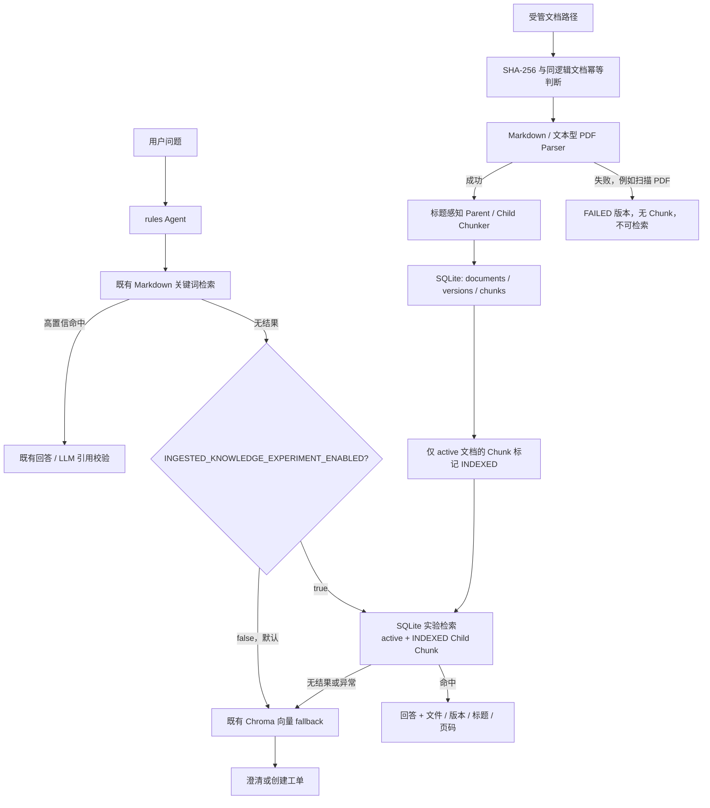
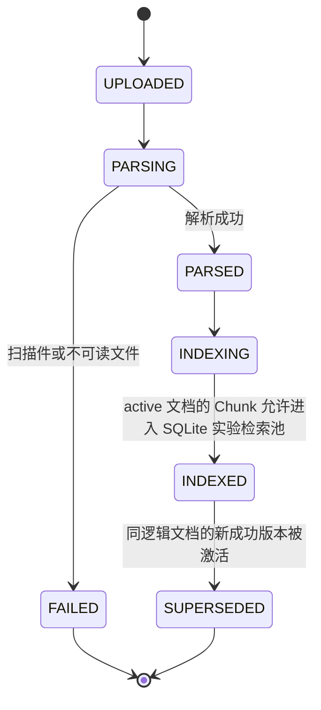

# RAG 2.0：最小文档摄入与受控检索架构

## 1. 这次增量解决的问题

原项目已经有 Markdown 知识库、关键词检索和 ChromaDB 向量检索，但它默认把文档当作静态内容使用，缺少以下可验证的文档治理能力：

- 同一制度不同版本如何识别和切换；
- 解析失败的文件如何避免污染检索；
- 回答如何说明来自哪个文件、哪个版本、哪一页；
- 新方案如何在不影响已有主 Agent 的前提下被验证。

RAG 2.0 因此新增一条 SQLite 驱动的最小实验链路。它不是第二套完整 RAG 系统，更不是替换 ChromaDB 的上线迁移；它的职责是验证“文档进入知识库后能否被可靠治理与追溯”。

## 2. 两条链路的关系

### 核心隔离原则

1. **旧主链路优先。** 既有关键词、ChromaDB、LLM 与工单流程仍是默认路径。
2. **实验默认关闭。** 环境变量不开启时，Agent 不调用新检索函数、不读取实验数据库。
3. **只在旧关键词无结果后尝试。** 实验命中不会覆盖已存在的旧高置信回答。
4. **异常可回退。** 实验检索报错或无结果，继续既有向量 fallback，而不是中断聊天。
5. **不维护两套状态图。** 本轮仅接入 rules Agent；LangGraph 保持原样，避免为实验分支扩大维护面。

## 3. 文档状态与准入语义

这里的 `INDEXED` 是一个容易被误解的词：它只表示 Chunk 已获准进入**隔离 SQLite 词面检索池**，不代表已经写入 ChromaDB，也不代表完成向量化。

## 4. 可追溯来源模型

实验检索返回 `RetrievalResult`，再由 `retrieval_result_to_source()` 映射到既有 API 的 `Source` 模型。旧字段保持兼容，新字段全部可选：

| 字段 | 含义 | 示例 |
| --- | --- | --- |
| `file` | 原始文件显示名 | `identity_access_policy_v2.md` |
| `document_id` | 本次具体版本 ID | `doc_...` |
| `document_version` | 业务版本号 | `v2` |
| `chunk_id` | 命中的 Child Chunk | `chunk_...` |
| `context_chunk_id` | 对应的 Parent Chunk | `parent_...` |
| `heading_path` | Markdown 标题上下文 | `["账号与权限", "权限申请"]` |
| `page_start` / `page_end` | 原始页码范围 | `2 / 2` |

Markdown 可稳定返回标题路径；当前基础 PDF Parser 只承诺文件、版本与页码。它不从视觉版式猜测标题，因此 PDF 的 `heading_path=[]` 是有意保留的诚实边界。

## 5. 已验证的结果

| 层级 | 脚本 | 结果 |
| --- | --- | --- |
| 数据模型 | `eval/run_knowledge_models_contract_eval.py` | 4/4 |
| Parser | `eval/run_document_parser_eval.py` | 3/3 |
| 摄入、幂等、失败隔离、版本替代 | `eval/run_knowledge_ingestion_contract_eval.py` | 5/5 |
| 来源回链兼容 | `eval/run_knowledge_source_reference_contract_eval.py` | 3/3 |
| active / INDEXED 检索准入 | `eval/run_ingested_knowledge_retrieval_contract_eval.py` | 3/3 |
| feature flag 与 fallback | `eval/run_ingested_knowledge_feature_flag_contract_eval.py` | 2/2 |
| 表格 PDF 基线 | `eval/run_pdf_parser_baseline_eval.py` | 2/2 |

既有主链路的 31 条固定集指标保持：Recall@3 `1.0000`、False Positive Rate `0`、MRR@3 `0.9551`、nDCG@3 `0.9602`。这些指标证明的是旧主链路在默认关闭实验开关时没有回归，并不等于 SQLite 实验检索已经取得同等真实数据效果。

## 6. 当前边界与后续触发条件

- 新链路当前是 SQLite 词面检索，不做向量化，也不写 ChromaDB；
- 没有上传 API、文档后台、多租户、RBAC、对象存储与删除补偿；
- 扫描型 PDF 失败隔离，尚未接 OCR；
- 表格 PDF 支持文本事实与页码，不支持可靠的行列级问答；
- 不迁移 Milvus，也不进行双写；原因见 [ADR-0001](adr/0001-keep-chroma-as-primary-vector-store.md)。

当拥有真实授权文档、明确吞吐 / 并发要求或表格行列级问答需求时，再以单独评测集和 feature flag 为前提进行下一步演进。
